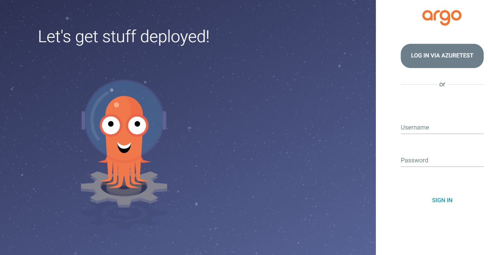

# argocd-dex
ArgoCD with Dex Configuration
# Install ArgoCD 
- To Install argoCD. Update the version if required.
    ```bash
        kubectl apply -k argocd-install/
    ```
- If you are using public cloud update svc for argocd-server as load balancer"
    ```bash
    kubectl patch svc argocd-server -n argocd -p '{"spec": {"type": "LoadBalancer"}}'
    ```
- Get Initial Secret : 
    ```
    kubectl -n argocd get secret argocd-initial-admin-secret -o jsonpath="{.data.password}" | base64 -d; echo
    ```
- Login to ArgoCD server to upate password 
    ```bash
    argocd login <ARGOCD_SERVER>
    argocd account update-password
    ```
# ArgoCD Dex Integration with Microsoft connector 
## Prerequsites 
- Create new application in AzureAD OIDC follow following link for the same
    [Quick Start : Register an application](https://docs.microsoft.com/en-us/azure/active-directory/develop/quickstart-register-app)
- Call back URL in your AzureAD application would be : 
    - https://<ArgoCD_Server_IP/URL>/api/dex/callback
- I worked with GKE so still needs to work with localhost. It should work for localhost too where the IP/URL is required.
 
## Lets run some commands now to get it work
### Microsoft Connector

- Following file needs to be updated: 
    - microsoft-connector/argocd-extra.yaml 

       -  \<Your Base64 Client Secret> : with your ClientSecret created in AzureAD for OIDC application
       -  <Your Clinet/ApplicationID of Azure app> : Client/Application ID in AuzreAD OIDC Application. 
       -  <ArgoCD_Server_IP/URL> : If you port forward your application to localhost it should be `localhost`
                                    If you create a nodeport type service it should be `localhost:nodeport`
                                    If you create a loadbalancer it will be your `loadbalancerIP`
- Lets first apply the file with configmap and secret changes 
    ```
    kubectl apply -f microsoft-connector/argocd-extra.yaml -n argo 
    ```
- Lets install argocd now
    ```
    kubectl apply -f microsoft-connector/argocd-install.yaml -n argo 
    ```
       
- Now port-forward your server to localhost or use the loadbalancer IP and you should see following screen: 
- URL should be : 
    -   https://localhost OR https://\<LoadBalancerIP>
    - Click on AZURETEST and it should authenticate your with AzureAD

    
